# Imagenes de prueba funcionamiento de API productos
## Creación del archivo requirements.txt
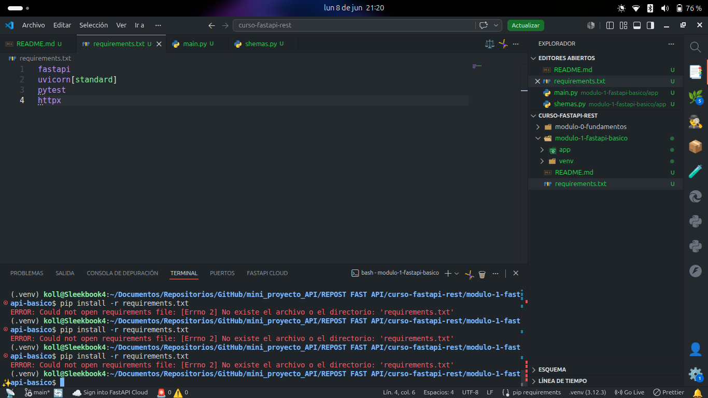
## Ejecución del proyecto por la terminal
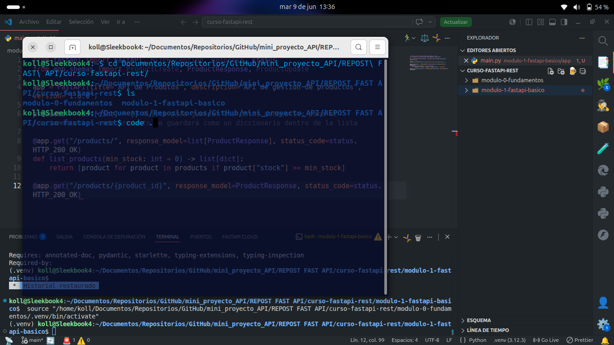
## Vizualización de carpetas, documento y terminal en VSC
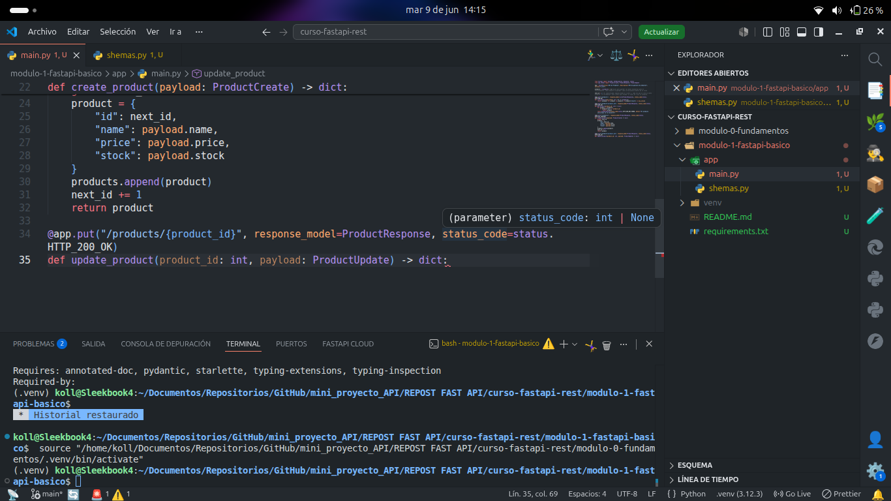
## Formateo de código
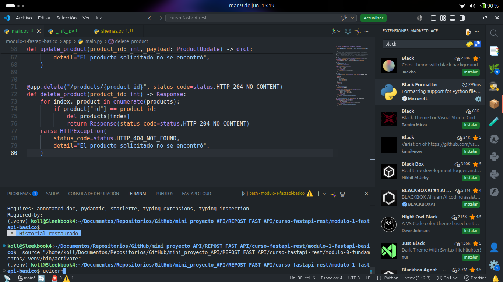
## Verificación de versión del FastAPI
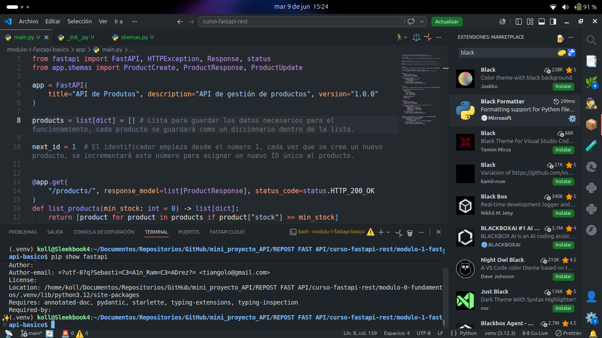
## Verificación de levantamiento de la API
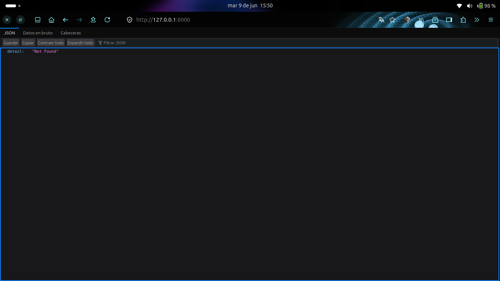
## Documentos de la API productos
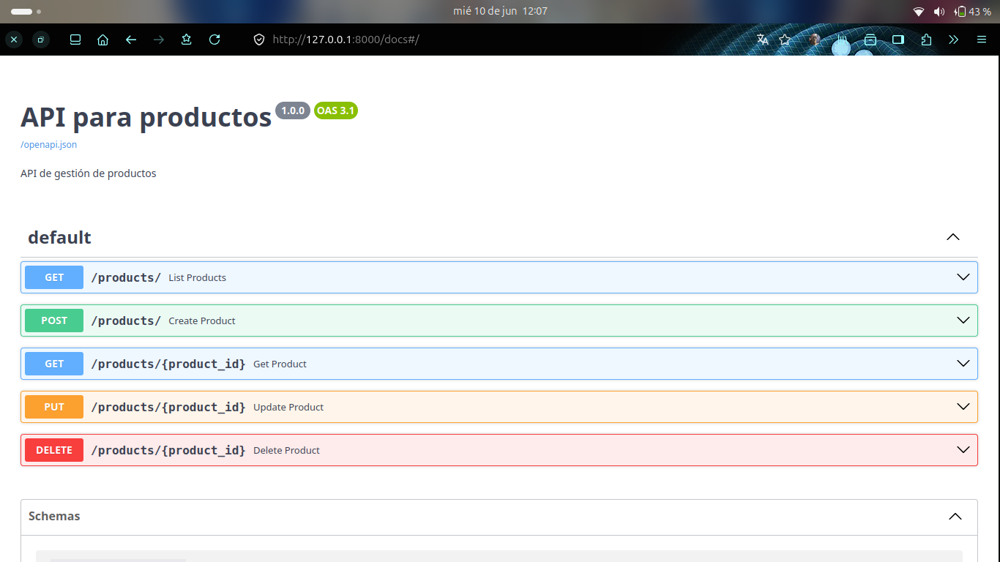
# Operaciones con URI por terminal
## POST
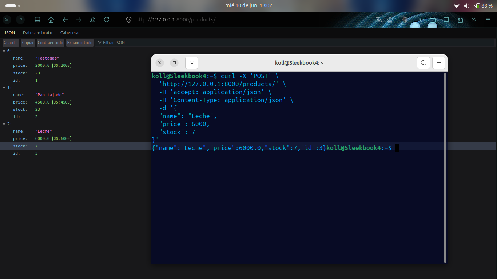
## GET 
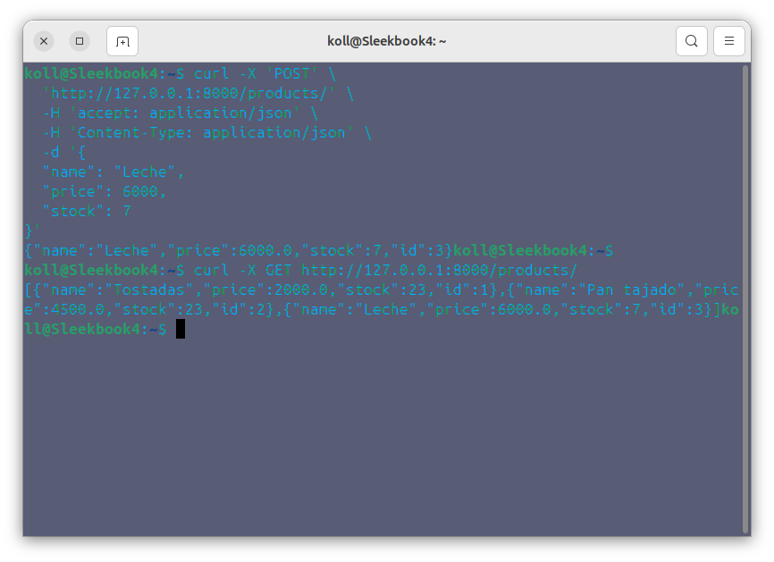
## GET {id}
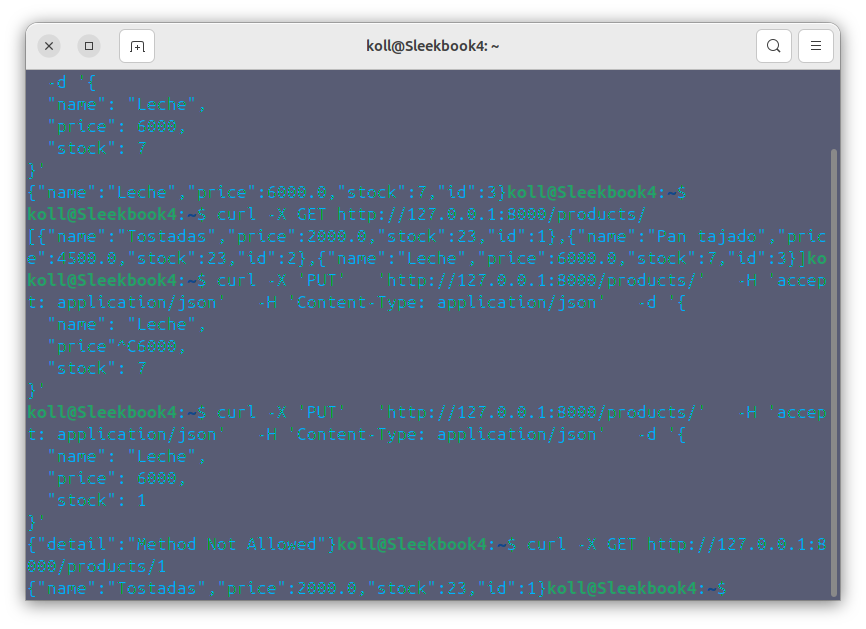
## PUT {id}
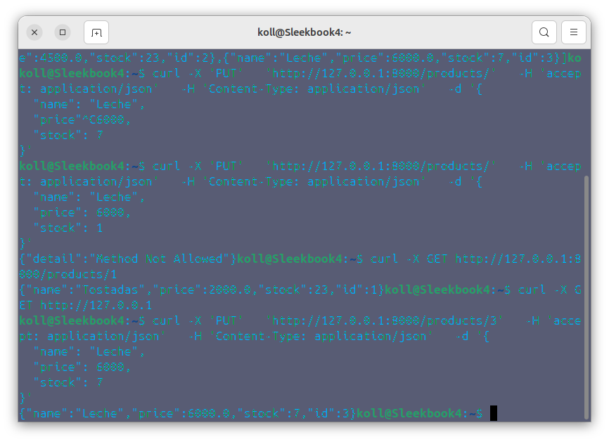