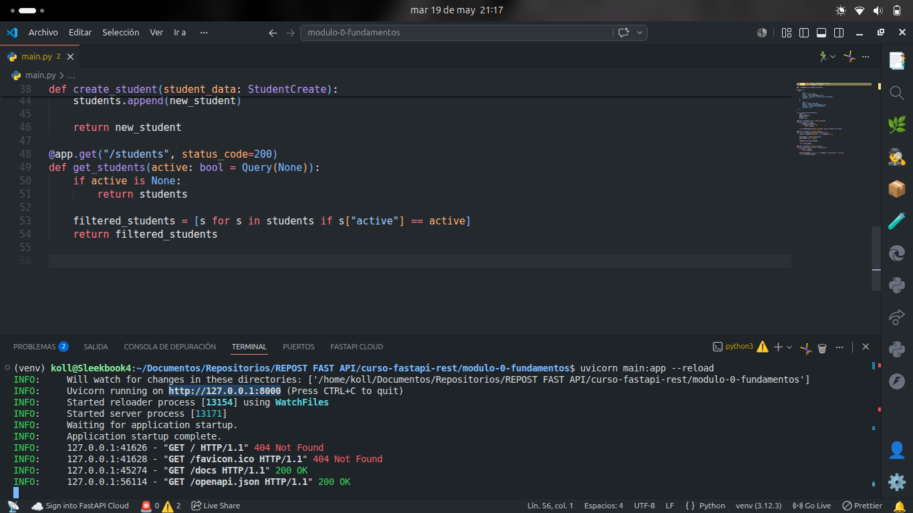
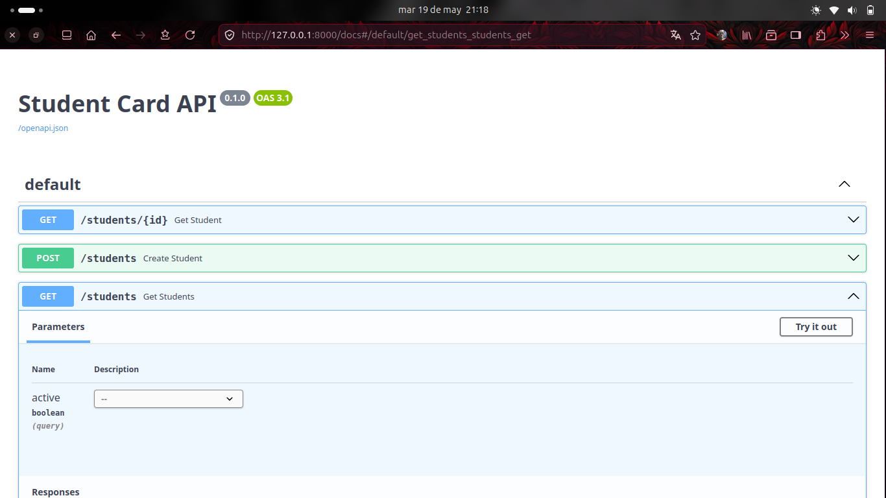
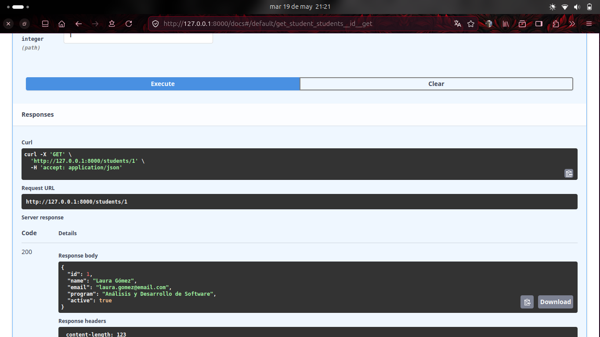
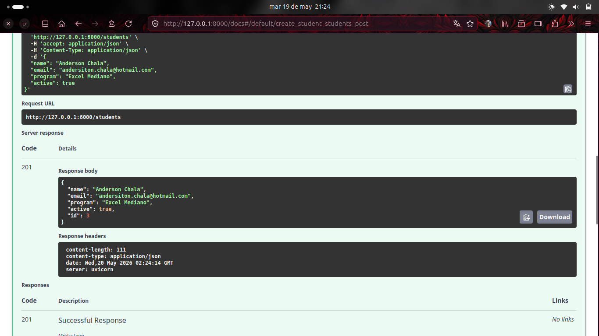
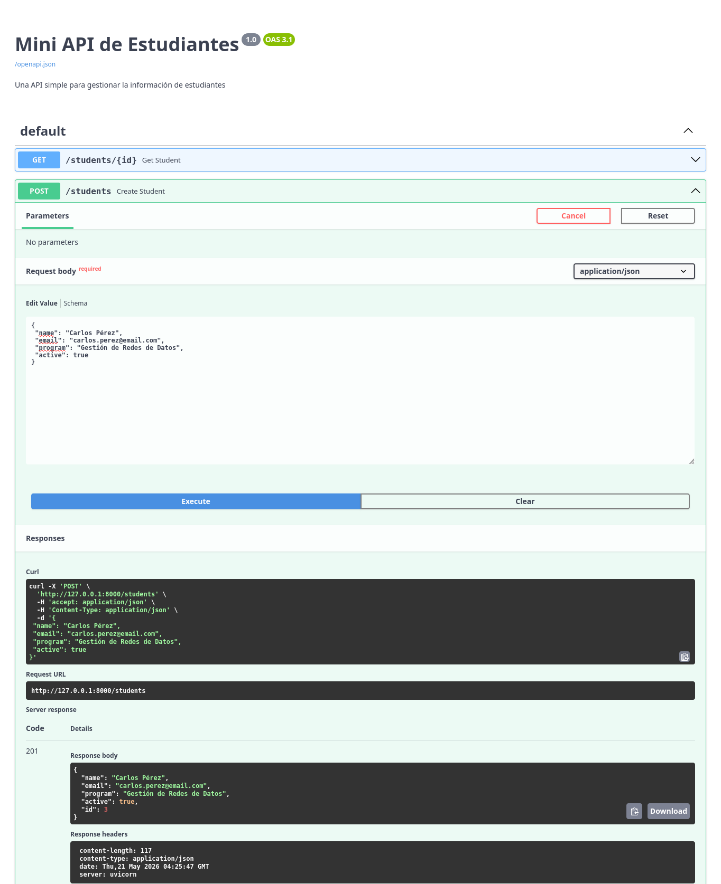
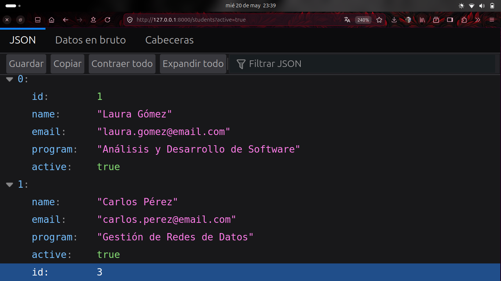
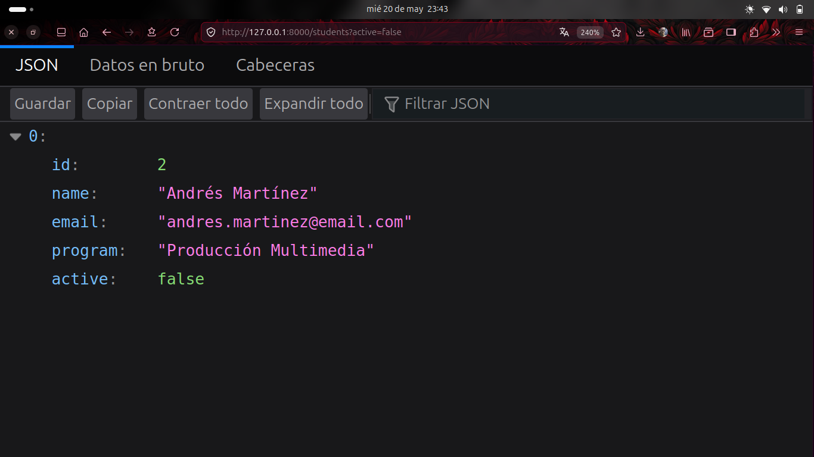

# Imagenes comprobación de resultados

# Evidencias solicitadas
## 1. Endpoint: GET /students/{id}

## 2. Endpoint: POST /students

## 3. Endpoint: GET /students?active=true
### TRUE

### FALSE

## Autoevaluación
1. ¿Qué es HTTP?
     Es el grupo de **reglas** que le dictan a tu navegador web y a los servidores que son requeridos el como relacionarse entre ellos.
2. ¿Qué diferencia hay entre GET y POST?
     La primera opción sirve para **consultar** información que ya hay y la segunda es para **publicar** o subir nueva información.
3. ¿Qué es una URI?
     Cadena de caracteres para **identificar** un recurso abstracto o físico.
4. ¿Qué significa 201? 
     Created (Creación exitosa de un recurso).
5. ¿Qué es serializar?
     Se define como la **conversión** de un objeto o estructura de datos a cadena de texto o binario.
6. ¿Para qué sirve venv?
     Es el **entorno virtual** de Python, se utiliza para evitar cualquier tipo de conflicto a la hora de realizar **pruebas** de un código puesto que en ocaciones puede haber complicaciones por extenciones u otras cosas.
7. ¿Qué hace Uvicorn?
     Se podría decir que es el **servidor** por excelencia para Python y es el complemento ideal para FastAPI.
8. ¿Qué es una path operation?
     Combitación de URL y HTTP que se realiza para generar un **endpoint** dentro de la API.
___
# Demostración de lo realizado el día de hoy

## 1. Obtener estudiante por ID (GET /students/{student_id})
Esta funcionalidad busca a un alumno específico dentro del listado utilizando su número único de identificación **(id)**.
+ **Operación:** El sistema recorre la base de datos temporal (la lista). Si encuentra el ID solicitado, retorna el objeto completo del estudiante. Si no existe coincidencia tras revisar todo el arreglo, detiene el proceso y arroja un error controlado 404 Not Found especificando que el alumno no fue hallado.
## 2. Crear nuevo estudiante (POST /students)
Permite registrar e incorporar un nuevo alumno al sistema enviando la estructura requerida en el cuerpo de la petición.
+ **Operación:** La API recibe los datos validados del estudiante, genera un ID incremental automático (calculando la longitud de la lista actual + 1) y anexa el nuevo registro al listado de datos. Finalmente, responde confirmando el éxito con el código de estado estándar 201 Created junto al objeto recién creado.
## 3. Listar y filtrar estudiantes (GET /students)
Permite visualizar la colección de alumnos del sistema, ofreciendo flexibilidad mediante un parámetro opcional de consulta en la URL.
+ **Operación:** Si se consulta de forma directa, retorna la lista completa con todos los estudiantes. En caso de especificar el parámetro lógico ?active=true o ?active=false, la funcionalidad filtra los datos sobre la marcha y retorna únicamente a aquellos estudiantes que cumplan estrictamente con la condición indicada.