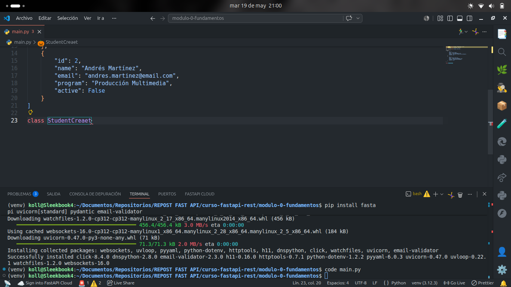
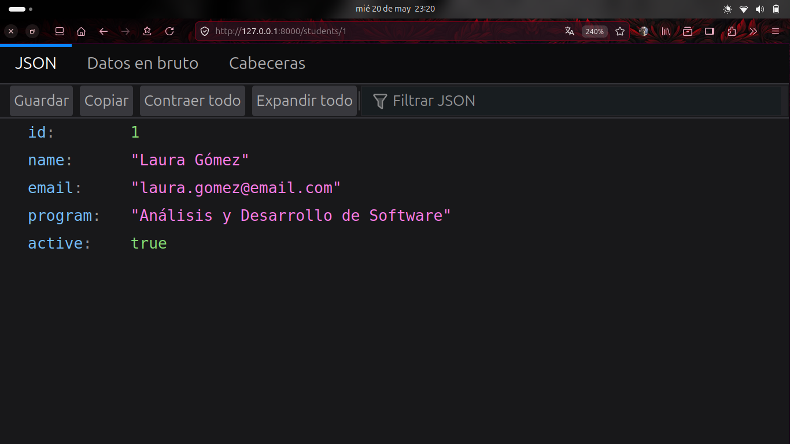

# Imagenes comprobación de resultados

# Evidencias solicitadas
## 1. Endpoint: GET /students/{id}

## 2. Endpoint: POST /students

## 3. Endpoint: GET /students?active=true
### TRUE

### FALSE

## Autoevaluación
1. ¿Qué es HTTP? 
     
2. ¿Qué diferencia hay entre GET y POST? 
     
3. ¿Qué es una URI? 
     
4. ¿Qué significa 201? 
     
5. ¿Qué es serializar? 
     
6. ¿Para qué sirve venv? 
     
7. ¿Qué hace Uvicorn? 
     
8. ¿Qué es una path operation?
     
